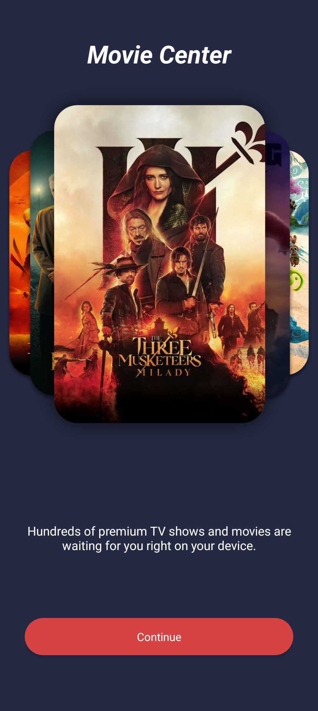
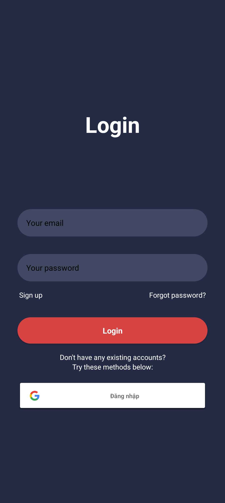
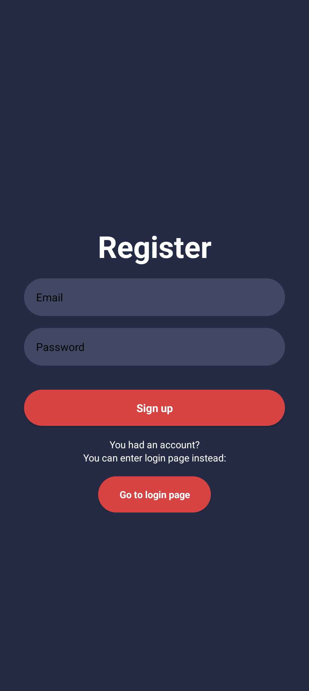
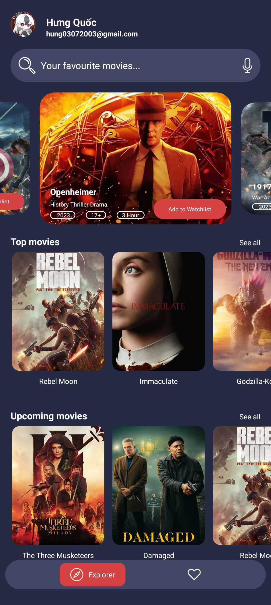
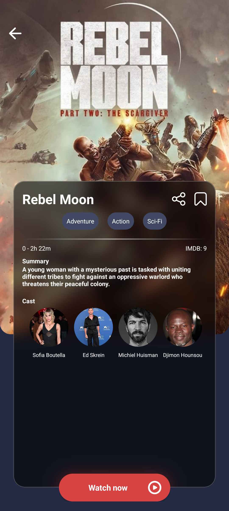
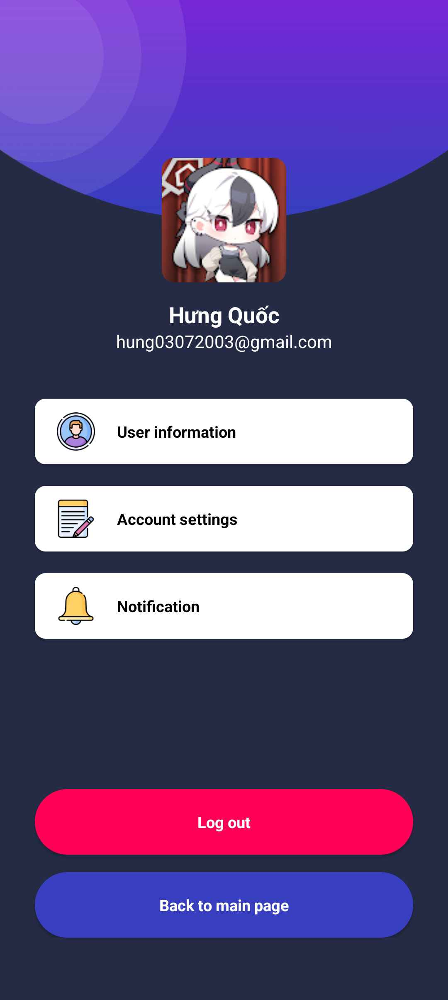

<h1 align="center" style="font-weight: bold;">Movie App 📽️</h1>

<p align="center">
<a href="#tech">Công nghệ</a> |
<a href="#layout">Ảnh chụp demo</a> |
<a href="#started">Cấu hình dự án</a> |
<a href="#contribute">Đóng góp thêm</a>

</p>

<p align="center">- Dự án `Movie App` này là một bài tập lớn về chủ đề xem phim, có triển khai một vài chức năng cơ bản của một ứng dụng xem phim tiêu chuẩn. <br>
- Vì đây là một dự án một người làm và vẫn <b>đang phát triển</b> nên có thể sẽ không vừa mắt mọi người xem cho lắm, mong mọi người hãy thông cảm vì điều này.</p>

<h2 id="technologies">💻 Công nghệ</h2>

- **Kotlin**
    + **Coroutines**: Thư viện chính thức của **Kotlin** giúp xử lý các tác vụ **bất đồng bộ**.
- **Firebase**
    + **Authentication**: API giúp xử lý xác thực thông tin người dùng.
    + **Realtime Database**: API giúp quản lý dữ liệu trong cơ sở dữ liệu trong thời gian thực.
    + **Storage**: API giúp chúng ta có thể lưu trữ các dữ liệu dạng `asset` như **ảnh, video, font, ...**
- Các thư viện **bên thứ 3**:
    + **Glide**: Thư viện giúp tải ảnh từ một nguồn nào đó lên ứng dụng.
    + **Chip Navigation Bar**: Thư viện giúp chúng ta thêm thanh điều hướng cuối màn hình.
    + **BlurView**: Thư viện xử lý các view được làm mờ.

<h2 id="layout">🎨 Ảnh chụp demo</h2>

<p align="center">
UI của ứng dụng sẽ khá vừa mắt với ai đang sử dụng thiết bị như <b>Google Pixel 8 Pro</b> (máy ảo) hoặc <b>Samsung Galaxy A14</b> (máy thật của mình) <br><br> 






</p>

<h3>Điều kiện tiên quyết</h3>
Để cấu hình dự án trơn tru, bạn sẽ cần những thứ phía dưới:

- [Java Development Kit 17](https://www.oracle.com/java/technologies/javase/jdk17-archive-downloads.html)
- [Git](https://git-scm.com/)
- [Android Studio](https://developer.android.com/studio) với phiên bản `Hedgehog` (**2023.1.1**) hoặc hơn

<h3>Nhân bản dự án</h3>
Hãy nhân bản kho lưu trữ từ GitHub về bằng lệnh:

```bash
git clone https://github.com/henry0337/movie_app.git
```

<h2 id="started">🚀 Cấu hình dự án</h2>

- Để dự án có thể chạy và không gặp bất cứ lỗi quan trọng nào, <br>bạn sẽ cần đến tệp `private.properties` với nội dung như sau:

```properties
FIREBASE_URL=<YOUR_FIREBASE_URL>
```
thay thế *<YOUR_FIREBASE_URL>* bằng đường dẫn tham chiếu tới dự án trên Firebase của bạn. Hãy đặt tệp đó vào thư mục gốc của dự án.

- Tiếp tục, bạn sẽ cần đến tệp `google-services.json`, tệp này chỉ có thể lấy được sau khi cấu hình xong dự án trên  **Firebase Console**,
sau khi lấy được nó bạn sẽ đặt vào thư mục `app` của dự án theo đường dẫn phía dưới, **tốt nhất bạn nên thực hiện bước này cuối cùng sau khi bạn đã chắc chắn cấu hình hoặc sửa đổi xong dự án Firebase**:
```
<PROJECT_ROOT>\app
```
với ***<PROJECT_ROOT>*** là vị trí dự án hiện tại của bạn.

- Vì đang sử dụng Firebase làm backend nên dự án ban đầu sẽ không có dữ liệu,<br>
bạn hãy xem video Youtube sau và link GitHub phía dưới để cấu hình dự án và lấy dữ liệu:
    + [Movies app Android Studio Project App Tutorial](https://www.youtube.com/watch?v=yv2e_r8dOf8) (**YouTube**)
    + [worldsat](https://github.com/worldsat/project182) (**GitHub**)

    (**Dự án này được base giao diện hoàn toàn dựa theo video YouTube trên, rất chân thành gửi lời cảm ơn tới [@UiLover](https://www.youtube.com/@UiLover)**)

- Dự án Firebase trên có sử dụng **Firebase `Authentication`**, khi thiết lập phần `Sign-in Method` hãy kích hoạt tính năng xác thực bằng:
    + **Email/Password**
    + **Google**

    riêng với việc xác thực bằng Google thì bạn sẽ phải có **dấu vân tay SHA-1** để Firebase có thể kích hoạt xác thực. <br>
    Để có thể lấy được dấu vân tay đó, bạn cần dùng lệnh sau tại `Terminal` trong thư mục gốc của dự án:
```bash
./gradlew signingReport
```
    
Đây là ví dụ về kết quả trả về:
```
Variant: debug
Config: debug
Store: %userprofile%\debug.keystore
Alias: AndroidDebugKey
MD5: <mã-MD5-nào-đó>
SHA1: <mã-SHA1-nào-đó>
SHA-256: <mã-SHA256-nào-đó>
Valid until: Tuesday, August 25, 2054

Variant: release
Config: null
Store: null
Alias: null
```

Bạn chỉ cần quan tâm tới dòng `SHA1: <mã-SHA1-nào-đó>` của phần có variant là `debug` , hãy sao chép giá trị này rồi ở tại màn hình dự án Firebase, chọn hình bánh răng ⚙️ bên cạnh "**Project Overview**" > "**Project Settings**", tại phần "**General**" tìm phần "**Your apps**", rồi tìm nút "**Add fingerprint**", cuối cùng dán mã SHA1 bạn vừa copy vào rồi ấn "Save". **Sau đó hãy nhớ tải tệp `google-services.json` ở ngay phía trên rồi thay thế tệp cũ (nếu có) là xong.**

<h3>Khởi động dự án</h3>

Tại vị trí thư mục gốc của dự án, hãy mở `Terminal` bằng cách ấn `Alt + F12` lên, rồi nhập những lệnh như sau:
```bash
./gradlew installDebug
``` 
**Hiển thị ra những máy ảo có sẵn hoặc đã được tạo**:
```bash
emulator -list-avds
```
**Chọn máy ảo cần sử dụng**:
```bash
emulator -avd avd_name
```
với *<avd_name>* là tên máy ảo cần sử dụng.
<br><br>
**Cuối cùng là cài đặt tệp APK của dự án**:
```bash
adb install path/to/your_app.apk
```
với *<path/to/your_app.apk>* là tên tệp APK được lưu trong đường dẫn:
```
project_name/module_name/build/outputs/apk/
```
với <*project_name*> và <*module_name*> lần lượt là: <*tên-dự-án*> và <*tên-mô-đun*>.

(Hoặc có một cách dễ dàng hơn, ấn vào nút ▶️ ở trên thanh Toolbar là xong :v)

<h2 id="contribute">📫 Đóng góp</h2>
Những đóng góp của mọi người luôn được đánh giá cao cho sự hoàn thiện của dự án. <br>
Để đóng góp, hãy thực hiện như các bước phía dưới:

1. Tạo một nhánh mới với cú pháp:
```bash
git checkout -b feature/NAME 
```
Lệnh này cũng sẽ đồng thời chuyển từ nhánh `master` sang nhánh mới bạn vừa tạo.

2. Hãy chỉnh sửa hoặc thêm tính năng theo ý bạn muốn và chờ được xem xét! <br>
(Nếu sau 6 tháng dự án này không nhận được phản hồi nào thì mình sẽ đưa kho lưu trữ này vào phần `Archived`.)
